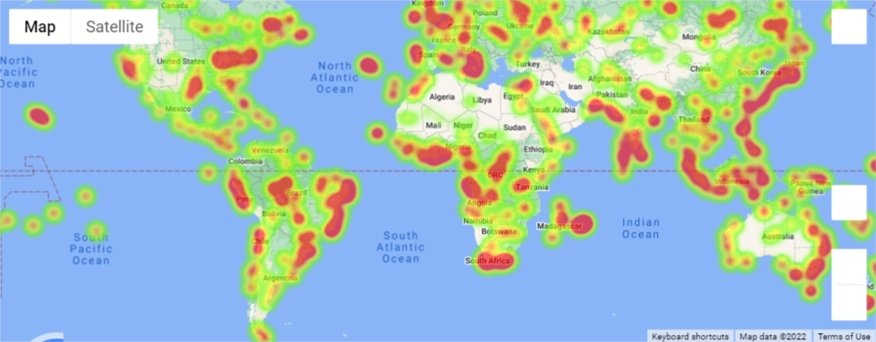
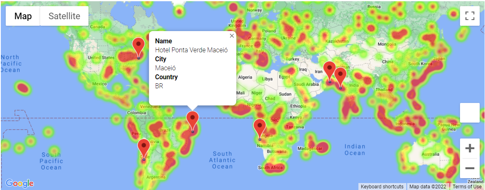

# What's the Weather Like?

## Part 1: WeatherPy

A Python script was used to visualize the weather of 500+ cities of varying distance from the equator. To do so, a [simple Python library](https://pypi.python.org/pypi/citipy), the [OpenWeatherMap API](https://openweathermap.org/api), and my problem-solving skills were used to create a representative model of weather across cities.

A series of scatter plots were created to showcase the following relationships:

* Temperature (F) vs. Latitude
* Humidity (%) vs. Latitude
* Cloudiness (%) vs. Latitude
* Wind Speed (mph) vs. Latitude

Also, linear regression was computed for each relationship and plots were separated into Northern Hemisphere (greater than or equal to 0 degrees latitude) and Southern Hemisphere (less than 0 degrees latitude):

* Northern Hemisphere - Temperature (F) vs. Latitude
* Southern Hemisphere - Temperature (F) vs. Latitude
* Northern Hemisphere - Humidity (%) vs. Latitude
* Southern Hemisphere - Humidity (%) vs. Latitude
* Northern Hemisphere - Cloudiness (%) vs. Latitude
* Southern Hemisphere - Cloudiness (%) vs. Latitude
* Northern Hemisphere - Wind Speed (mph) vs. Latitude
* Southern Hemisphere - Wind Speed (mph) vs. Latitude

### Part 2: VacationPy

Jupyter-gmaps and the Google Places API were used to work with weather data to plan future vacations.

A heat map was created to display the humidity for every city from Part 1, as in the following image:

   

* The DataFrame was narrowed down to find an ideal weather condition. For example:

  * A max temperature lower than 80 degrees but higher than 70.

  * Wind speed less than 10 mph.

  * Zero cloudiness.

  * Any rows that didn't satisfy all three conditions were dropped to ensure the weather is ideal.

* Google Places API was used to find the first hotel for each city located within 5,000 meters of my coordinates.

* Hotels were plotted on top of the humidity heatmap, with each pin containing the **Hotel Name**, **City**, and **Country**, as in the following image:

  
